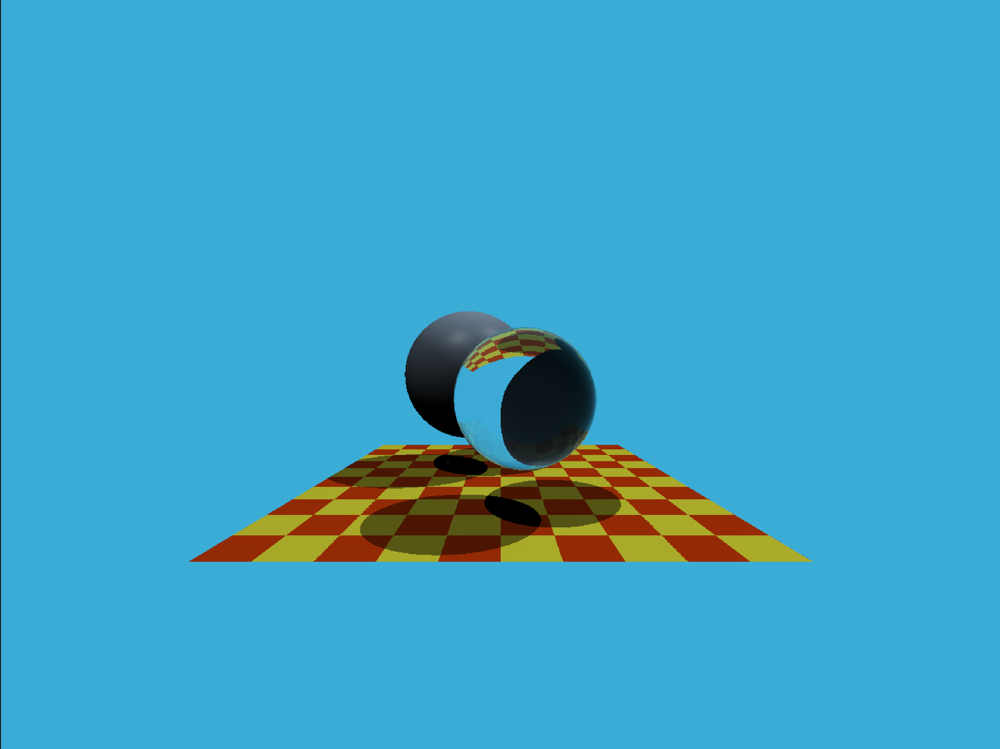
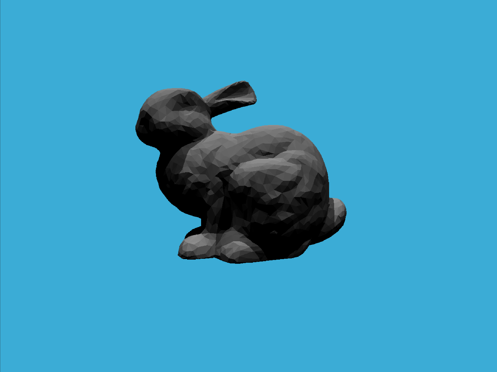
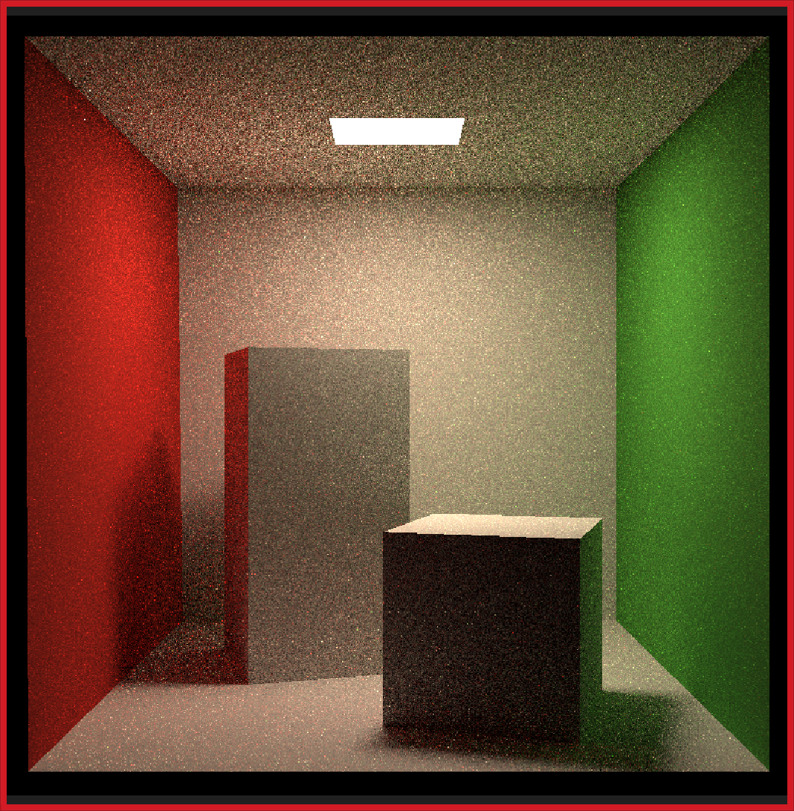
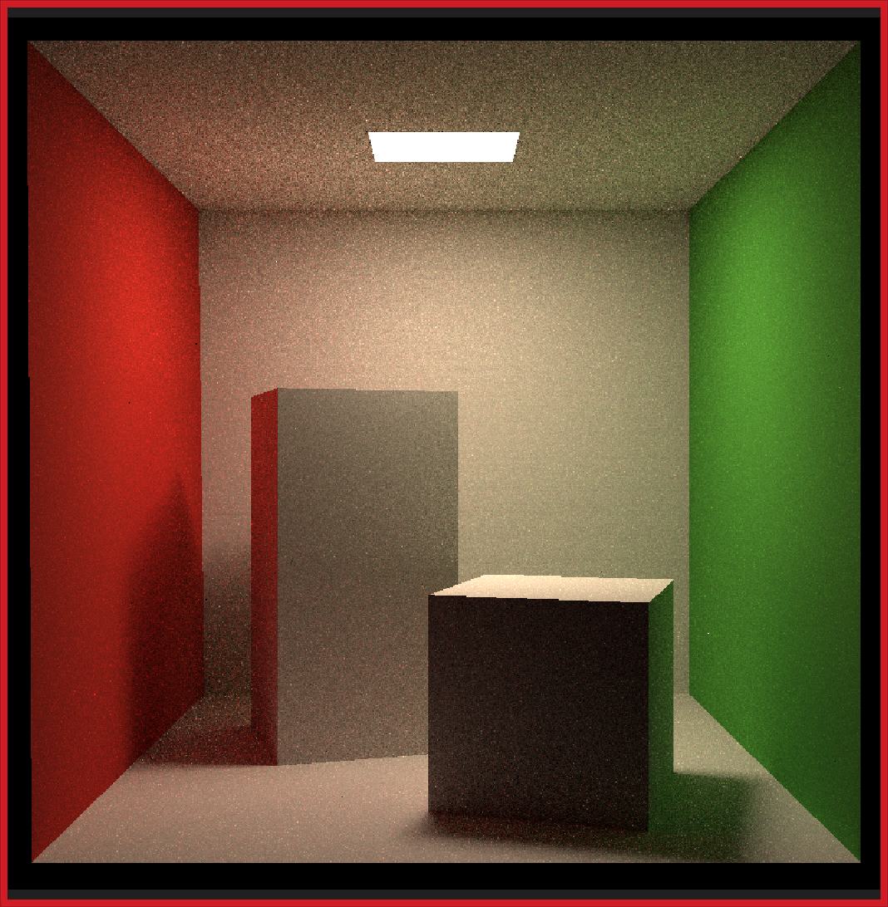
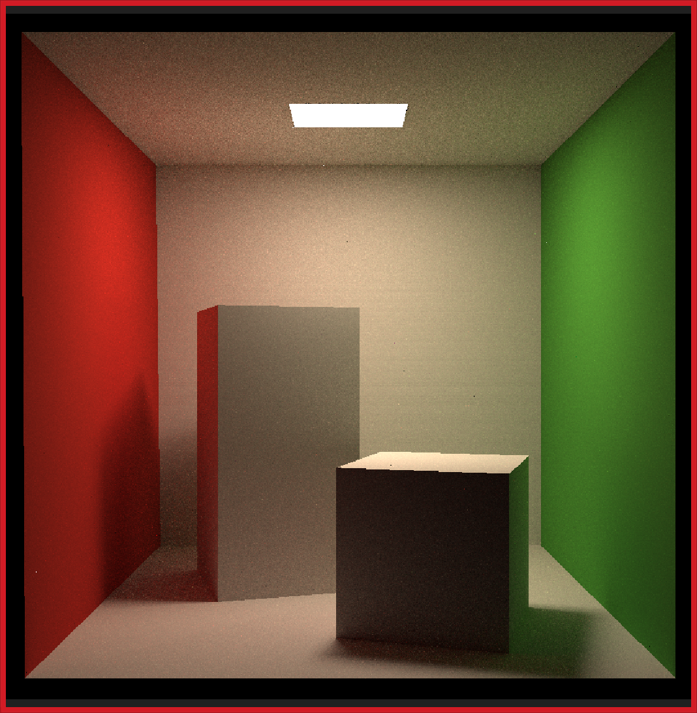

## Games101的作业记录

### 3.Pipeline and Shading
- bumpmap 
   
- texture_bilinear 
   

### 4.贝塞尔曲线
- 根据任意数量点生成对应的贝塞尔曲线
- 增加自定义的看锯齿效果
  - 没有加抗锯齿的效果
  - 增加了抗锯齿效果
  
### 5.光线与三角形相交
- 

### 6.加速结构
- 默认BVH对应Render耗时11seconds，使用SAH加速后耗时10seconds
- 
  
### 7.路径追踪
- 16SPP 
- 64SPP 
- 256SPP 